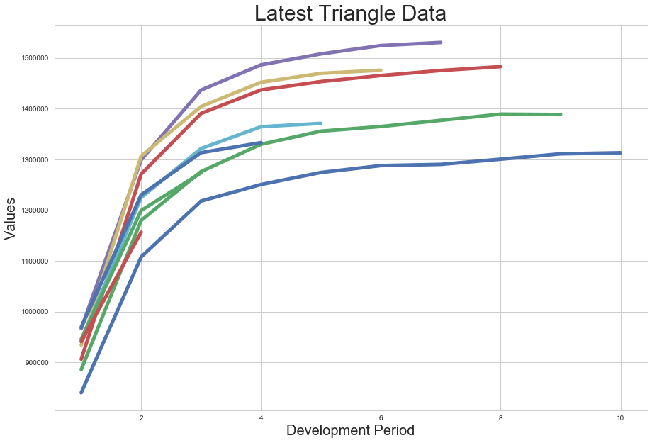
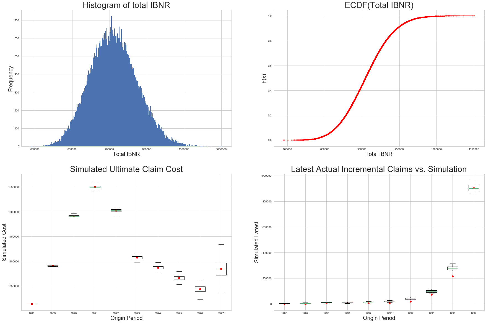

Bootstrap chainladder model
===========================

Now we will explore the properties and methods underlying the Munich
Chainladder class.

As usual, we we import the chainladder package as well as the popular
pandas and numpy package. For plotting purposes, we will also be using
Jupyter’s ``%matplotlib inline`` magic function to render the plots.

In this tutorial we will use industry data from the `LOSS RESERVING DATA
PULLED FROM NAIC SCHEDULE
P <http://www.casact.org/research/index.cfm?fa=loss_reserves_data>`__

.. code:: ipython3

    import chainladder as cl
    import pandas as pd
    import numpy as np
    %matplotlib inline

Import the data
~~~~~~~~~~~~~~~

The CAS Loss Reserving incurred data is schedule P data and would
include include IBNR. Additionally, the database includes the completed
triangles (i.e. the latest accident year has valuations at age 10
years). We will focus on Workers' Compensation data.

We will: - Read in the data - Devlop a case incurred metric - Summarize
data across all carriers - Retain age 10 actual case incurred -
Eliminate known data beyond year end of 1997

.. code:: ipython3

    # Read in the data
    CAS = pd.read_csv(r'http://www.casact.org/research/reserve_data/wkcomp_pos.csv')
    # Devlop a case incurred metric
    CAS['INC_LOSS'] = CAS['IncurLoss_D']-CAS['BulkLoss_D']
    # Summarize data across all carriers
    WCTri = pd.pivot_table(data=CAS, values='INC_LOSS', index=['AccidentYear'],columns=['DevelopmentLag'], aggfunc=np.sum)
    WCTri.columns = [str(item) for item in WCTri.columns]
    # Retain age 10 actual case incurred
    Ult10_values = WCTri.iloc[:,-1]
    # Eliminate known data beyond year end of 1997
    WCTri=pd.DataFrame(np.array(WCTri)*np.array([np.append(np.array([1]*(len(WCTri)-i)),np.array([np.nan]*i)) for i in range(len(WCTri))]),
                       index = WCTri.index, columns=WCTri.columns)

Plot the triangle
~~~~~~~~~~~~~~~~~

.. code:: ipython3

    cl.Triangle(WCTri).plot()

.. parsed-literal::

    <matplotlib.figure.Figure at 0x2628e2514a8>

Generate bootstrap chainladder model
~~~~~~~~~~~~~~~~~~~~~~~~~~~~~~~~~~~~

.. code:: ipython3

    BS = cl.BootChainladder(WCTri, n_sims=50000)

The bootstrap model plots provide various diagnotics to enable a better
understanding of the distribution of carried IBNR.

.. code:: ipython3

    BS.plot()

.. parsed-literal::

    <matplotlib.figure.Figure at 0x2628e9ae630>

Verify results
~~~~~~~~~~~~~~

We should expect enough credibility/stability in industrywide data that
the Chainladder method is a reasonably good model for developing the
triangle. We will use the Bootstrap mean ultimates to test this. As the
Bootstrap model was fit without a tail, the ultimate represents age 10
Expected Incurred amount.

.. code:: ipython3

    print('Case Incurred Actual vs Bootstrap Expected gap at age 10 is ' 
          + str(round(np.sum(Ult10_values - BS.summary()['Mean Ultimate'].round(0))/np.sum(Ult10_values)*100,2))
          +'% of total case inurred at age 10')
    (Ult10_values - BS.summary()['Mean Ultimate'].round(0))/Ult10_values

.. parsed-literal::

    Case Incurred Actual vs Bootstrap Expected gap at age 10 is 0.35% of total case inurred at age 10
    

.. parsed-literal::

    AccidentYear
    1988    0.000000
    1989    0.003534
    1990    0.005089
    1991    0.004941
    1992    0.011566
    1993    0.003519
    1994    0.018664
    1995    0.009364
    1996    0.000490
    1997   -0.024164
    dtype: float64

