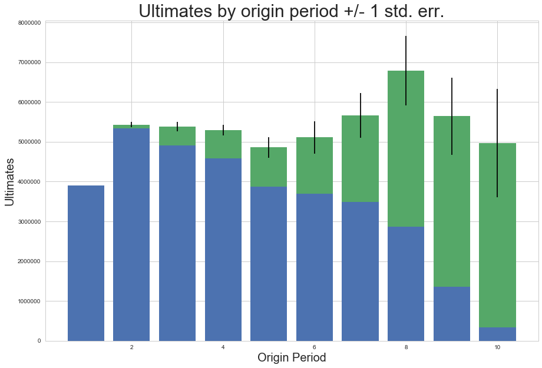
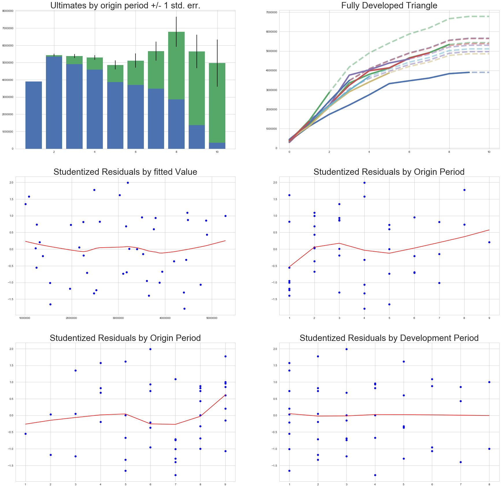

Mack chainladder model
======================

We will explore the properties and methods underlying the
MackChainladder class.

As usual, we we import the chainladder package as well as the popular
pandas package. For plotting purposes, we will also be using Jupyter's
``%matplotlib inline`` magic function.

Load package and data
~~~~~~~~~~~~~~~~~~~~~

.. code:: ipython3

    import chainladder as cl
    import pandas as pd
    %matplotlib inline

  

We will be exploring the MackChainladder class on the ``GenIns`` dataset
included in the **chainladder** package. Let's load the triangle and
look at it.

.. code:: ipython3

    GI = cl.load_dataset('GenIns')
    GI_tri = cl.Triangle(GI)
    GI_tri.data

========== ======== ========== ========== ========== ========== ========== ========== ========== ========== ========== 
       dev        1          2          3          4          5          6          7          8          9         10     
========== ======== ========== ========== ========== ========== ========== ========== ========== ========== ========== 
**origin**
**1**        357848    1124788    1735330    2218270    2745596    3319994    3466336    3606286    3833515    3901463  
**2**        352118    1236139    2170033    3353322    3799067    4120063    4647867    4914039    5339085        NaN
**3**        290507    1292306    2218525    3235179    3985995    4132918    4628910    4909315        NaN        NaN
**4**        310608    1418858    2195047    3757447    4029929    4381982    4588268        NaN        NaN        NaN
**5**        443160    1136350    2128333    2897821    3402672    3873311        NaN        NaN        NaN        NaN
**6**        396132    1333217    2180715    2985752    3691712        NaN        NaN        NaN        NaN        NaN
**7**        440832    1288463    2419861    3483130        NaN        NaN        NaN        NaN        NaN        NaN
**8**        359480    1421128    2864498        NaN        NaN        NaN        NaN        NaN        NaN        NaN
**9**        376686    1363294        NaN        NaN        NaN        NaN        NaN        NaN        NaN        NaN
**10**       344014        NaN        NaN        NaN        NaN        NaN        NaN        NaN        NaN        NaN
========== ======== ========== ========== ========== ========== ========== ========== ========== ========== ========== 

Create the MackChainladder model
~~~~~~~~~~~~~~~~~~~~~~~~~~~~~~~~

To create a MackChainladder model, we can specify up to four elements. A
triangle is the only non-optional element that needs to be specified to
create the model. Another parameter of interest we will be using here is
the alpha parameter.

| Thomas Mack establishes a parameter alpha as a way of generalizing the
  chainladder formula into a weighted least squares regression that
  works for:
| *alpha = 0* : straight average of link-ratios
| *alpha = 1* : volume weighted chainladder
| *alpha = 2* : ordinary least squares regression with intercept 0

The default parameter is *alpha = 1*

For all other parameters, please refer to the documentation of the
MackChainladder class.

**Load the Data**

.. code:: ipython3

    GI_mack = cl.MackChainladder(tri = GI_tri)

There are a variety of attributes and methods available in the
MackChainladder class. Most of these borrow notation similar to that of
the **`R chainladder <https://github.com/mages/ChainLadder>`__**
package, but there are a few differences. A complete list of attributes
and methods are shown below. Details on these are contained in the
`documentation <MackChainLadder.html>`__ of this module.

\*\* Available attributes and methods \*\*

.. code:: ipython3

    [item for item in dir(GI_mack) if item[:1]!='_']

.. parsed-literal::

    ['Fse',
     'age_to_age',
     'alpha',
     'chainladder',
     'f',
     'fse',
     'full_triangle',
     'is_exponential_tail_appropriate',
     'mack_se',
     'parameter_risk',
     'plot',
     'process_risk',
     'sigma',
     'summary',
     'total_mack_se',
     'total_parameter_risk',
     'total_process_risk',
     'triangle',
     'weights']

Mack model summary
~~~~~~~~~~~~~~~~~~

A useful method is the summary() method. This will produce, by origin
period, the IBNR estimate based off of the MackChainladder model as well
as its corresponding standard error. This is useful in gaining deeper
insight into the uncertainty in the model.

.. code:: ipython3

    GI_mack.summary().round(3)

========= ======= =========== =========== ============ ============ =========
origin     Latest Dev to Date    Ultimate         IBNR    Mack S.E.  CV(IBNR)
========= ======= =========== =========== ============ ============ =========
1   	  3901463      1.000  3901463.000        0.000        0.000       NaN
2  	  5339085      0.983  5433718.815    94633.815    71835.187     0.759
3  	  4909315      0.913  5378826.290   469511.290   119473.736     0.254
4  	  4588268      0.866  5297905.821   709637.821   131572.833     0.185
5   	  3873311      0.797  4858199.639   984888.639   260530.015     0.265
6  	  3691712      0.722  5111171.458  1419459.458   410406.890     0.289
7  	  3483130      0.615  5660770.620  2177640.620   557795.542     0.256
8  	  2864498      0.422  6784799.012  3920301.012   874882.218     0.223
9  	  1363294      0.242  5642266.263  4278972.263   970959.785     0.227
10 	   344014      0.069  4969824.694  4625810.694  1362981.070     0.295
========= ======= =========== =========== ============ ============ =========

Plotting the Mack model
~~~~~~~~~~~~~~~~~~~~~~~

In many cases, we prefer a visual representation of the model, and can
represent much of the same data contained in the summary() method by
calling the plot() method.

The plot() method can be passed a list of desired plots or it can be
generically called to plot all available plots.

**Individual plot**

.. code:: ipython3

    GI_mack.plot(plots=['summary'])

.. parsed-literal::

    <matplotlib.figure.Figure at 0x233ac232390>

**Plotting default (all plots)**

.. code:: ipython3

    GI_mack.plot()

.. parsed-literal::

    <matplotlib.figure.Figure at 0x233acb89cf8>

