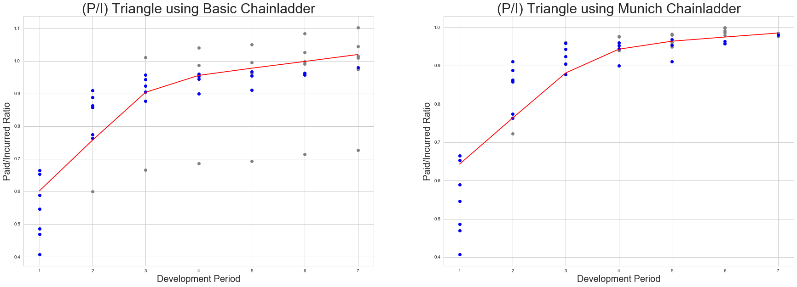
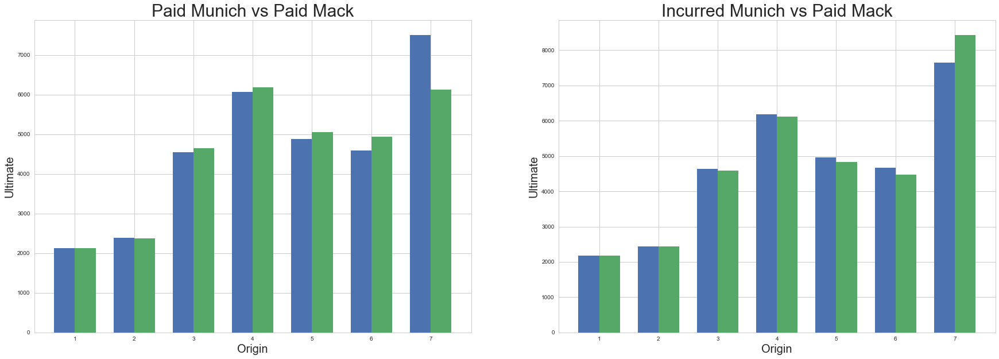
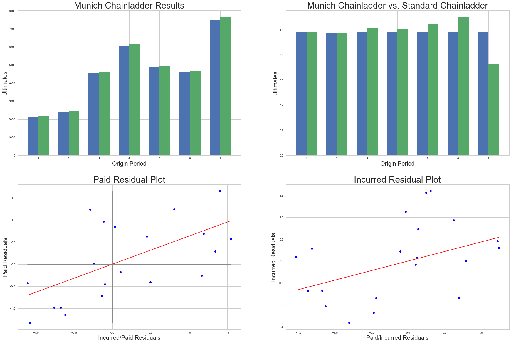

Munich chainladder model
========================

Now we will explore the properties and methods underlying the Munich
Chainladder class.

As usual, we we import the chainladder package as well as the popular
pandas package. For plotting purposes, we will also be using Jupyter's
``%matplotlib inline`` magic function.

Load package and data
~~~~~~~~~~~~~~~~~~~~~

.. code:: ipython3

    import chainladder as cl
    import pandas as pd
    %matplotlib inline

   

The Munich chainladder method is useful when both a paid and incurred
triangle are available. It is an improvement on the standard chainladder
in that it considers the ratio of Paid/Incurred **(P/I)** triangle to
adjust both the paid and incurred ultimates. A nice property of the
Munich chainladder method is that the **(P/I)** ratio approaches 1.0 as
the development period approaches ultimate. This makes the Paid ultimate
and Incurred ultimate converge towards the same value, a property not
found in the basic chainladder method.

The chainladder package comes loaded with ``MCLincurred`` and
``MCLpaid`` datasets to illustrate the Munich Chainladder method. We
will load these and verify that the **(P/I)** ratios approach 1.0

.. code:: ipython3

    MCL_inc = cl.load_dataset('MCLincurred')
    MCL_paid = cl.load_dataset('MCLpaid')
    MCL_paid/MCL_inc

==========  ======== ========= ========= ========= ========= ========= ========= 
dev             1         2         3         4         5         6         7
==========  ======== ========= ========= ========= ========= ========= ========= 
**origin**
**1**       0.588957  0.857414  0.923149  0.944030  0.954002  0.963336  0.980221
**2**       0.469631  0.763323  0.876723  0.900000  0.910686  0.956805       NaN
**3**       0.486226  0.863114  0.905066  0.960000  0.967700       NaN       NaN
**4**       0.652770  0.888218  0.942998  0.952458       NaN       NaN       NaN
**5**       0.664296  0.773863  0.957955       NaN       NaN       NaN       NaN
**6**       0.545799  0.910123       NaN       NaN       NaN       NaN       NaN
**7**       0.407009       NaN       NaN       NaN       NaN       NaN       NaN
==========  ======== ========= ========= ========= ========= ========= ========= 

Create the Munich chainladder model
~~~~~~~~~~~~~~~~~~~~~~~~~~~~~~~~~~~

The Munich chainladder model, unlike the Mack model, only allows for
volume-weighted link-ratios. As such, there is no alpha parameter. Like
the Mack model, we do have the option of specifying exponential tail
fits to our data, but for the purposes of this tutorial we will allow
the tails to default to 1.0.

.. code:: ipython3

    MCL = cl.MunichChainladder(MCL_paid, MCL_inc)

The summary shows that the Ult. Paid and Ult. Incurred are indeed very
close, with paids slightly less than incurred.

.. code:: ipython3

    MCL.summary()

======= =========== ================ ================= ============ ============== ==========
origin  Latest Paid  Latest Incurred  Latest P/I Ratio    Ult. Paid  Ult. Incurred  P/I Ratio
======= =========== ================ ================= ============ ============== ==========
**1**        2131.0           2174.0          0.980221  2131.000000    2174.000000   0.980221
**2**        2348.0           2454.0          0.956805  2384.842092    2443.222400   0.976105
**3**        4494.0           4644.0          0.967700  4553.623621    4634.357895   0.982579
**4**        5850.0           6142.0          0.952458  6069.509293    6182.347407   0.981748
**5**        4648.0           4852.0          0.957955  4878.950383    4957.805406   0.984095
**6**        4010.0           4406.0          0.910123  4598.995746    4672.401782   0.984289
**7**        2044.0           5022.0          0.407009  7504.575860    7655.377611   0.980301
======= =========== ================ ================= ============ ============== ==========

Comparison to the basic chainladder
~~~~~~~~~~~~~~~~~~~~~~~~~~~~~~~~~~~

We can see that the basic chainladder does not guarantee that the paid
and incurred ratios converge to 1.0, with the below data ranging from a
low of 0.73 to a high of 1.11.

.. code:: ipython3

    MCL.plot(plots=['PI1','PI2'])

.. parsed-literal::

    <matplotlib.figure.Figure at 0x221b68f0080>

The Munich model's effect on ultimates can be drastic by origin year.
For this data, a paid Mack approach would understand the latest origin
period relative to both the Munich method and the Mack Incurred
ultimate.

.. code:: ipython3

    MCL.plot(plots=['MCLvsMackpaid','MCLvsMackinc'])

.. parsed-literal::

    <matplotlib.figure.Figure at 0x221b753fa20>

An 'R' view
~~~~~~~~~~~

Not specifying plots will render a view similar to the chainladder
package in R which includes residual graphs.

.. code:: ipython3

    MCL.plot()

.. parsed-literal::

    <matplotlib.figure.Figure at 0x221b7043860>

