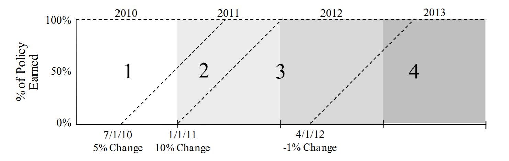

.. _adjustments:

.. currentmodule:: chainladder

=================
Data Adjustments
=================
There are many useful data adjustments in reserving that are not necessarily direct
IBNR models nor development factor selections.  This module covers those implemented
by ``chainladder``.  In all cases, these adjustments are most useful when used
as part of a larger `workflow`.

.. _bootstrap:

BootstrapODPSample
==================

Simulations
-------------

:class:`BootstrapODPSample` is a transformer that simulates new triangles
according to the ODP Bootstrap model.  That is both the ``index`` and ``column``
of the Triangle must be of unity length.  Upon fitting the Estimator, the
``index`` will contain the individual simulations.

  >>> import chainladder as cl
  >>> raa = cl.load_sample('raa')
  >>> cl.BootstrapODPSample(n_sims=500).fit_transform(raa)
  Valuation: 1990-12
  Grain:     OYDY
  Shape:     (500, 1, 10, 10)
  Index:      ['Total']
  Columns:    ['values']

.. note::
   The `BootstrapODPSample` can only apply to single triangles as it needs the
   ``index`` axis to be free to hold the different triangle simluations.

Dropping
---------
The Estimator has full dropping support consistent with the `Development` estimator.
This allows for eliminating problematic values from the sampled residuals.

  >>> cl.BootstrapODPSample(n_sims=100, drop=[('1982', 12)]).fit_transform(raa)
              Triangle Summary
  Valuation:           1990-12
  Grain:                  OYDY
  Shape:      (100, 1, 10, 10)
  Index:               [Total]
  Columns:            [values]

Deterministic methods
----------------------

The class only simulates new triangles from which you can generate
statistics about parameter and process uncertainty.  This allows for converting
the various deterministic :ref:`IBNR Models <methods_toc>` into stochastic
methods.

An example of using the :class:`BootstrapODPSample` with the :class:`BornhuetterFerguson`
method:

.. figure:: /auto_examples/images/sphx_glr_plot_stochastic_bornferg_001.png
   :target: ../auto_examples/plot_stochastic_bornferg.html
   :align: center
   :scale: 70%

Like the `Development` estimators, The `BootstrapODPSample` allows for ommission
of certain residuals from its sampling algorithm with a suite of "dropping"
parameters.  See :ref:`Omitting Link Ratios<dropping>`.

.. topic:: References

  .. [SM2016] `M Shapland, "Using the ODP Bootstrap Model: A Practitioner's Guide", CAS Monograph No.4 <https://live-casact.pantheonsite.io/sites/default/files/2021-02/04-shapland.pdf>`__

.. _berqsherm:

BerquistSherman
================
:class:`BerquistSherman` provides a mechanism of restating the inner diagonals of a
triangle for changes in claims practices.  These adjustments can materialize in
case incurred and paid amounts as well as closed claims count development.

In all cases, the adjustments retain the unadjusted latest diagonal of the
triangle.  For the Incurred adjustment, an assumption of the trend rate in
average open case reserves must be supplied.  For the adjustments to paid
amounts and closed claim counts, an estimator, such as `Chainladder` is needed
to calulate ultimate reported count so that the ``disposal_rate_`` of the
model can be calculated.

Adjustments
---------------
The `BerquistSherman` technique requires values for ``paid_amount``, ``incurred_amount``,
``reported_count``, and ``closed_count`` to be available in your `Triangle`.  Without
these triangles, the `BerquistSherman` model cannot be used.  If these conditions
are satisfied, the `BerquistSherman` technique adjusts all triangles except the
``reported_count`` triangle.

The Estimator wraps all adjustments up in its ``adjusted_triangle_`` property.

>>> import chainladder as cl
>>> triangle = cl.load_sample('berqsherm').loc['MedMal']
>>> berq = cl.BerquistSherman(
...     paid_amount='Paid', incurred_amount='Incurred',
...     reported_count='Reported', closed_count='Closed',
...     trend=0.15).fit(triangle)
>>> # Only Reported triangle is left unadjusted
>>> (triangle / berq.adjusted_triangle_)['Reported']
       12   24   36   48   60   72   84   96
1969  1.0  1.0  1.0  1.0  1.0  1.0  1.0  1.0
1970  1.0  1.0  1.0  1.0  1.0  1.0  1.0  NaN
1971  1.0  1.0  1.0  1.0  1.0  1.0  NaN  NaN
1972  1.0  1.0  1.0  1.0  1.0  NaN  NaN  NaN
1973  1.0  1.0  1.0  1.0  NaN  NaN  NaN  NaN
1974  1.0  1.0  1.0  NaN  NaN  NaN  NaN  NaN
1975  1.0  1.0  NaN  NaN  NaN  NaN  NaN  NaN
1976  1.0  NaN  NaN  NaN  NaN  NaN  NaN  NaN

Latest Diagonal
----------------
Only the inner diagonals of the `Triangle` are adjusted.  This allows the
``adjusted_triangle_`` to be a drop in surrogate for the original.

  >>> (triangle / berq.adjusted_triangle_)['Paid'].round(2)
          12    24    36    48    60    72    84   96
  1969  2.07  3.36  1.60  1.39  0.75  1.21  0.89  1.0
  1970  0.76  2.21  1.24  1.00  0.87  1.50  1.00  NaN
  1971  1.77  4.35  1.74  1.29  0.76  1.00   NaN  NaN
  1972  0.71  2.35  1.62  1.25  1.00   NaN   NaN  NaN
  1973  1.32  1.60  0.72  1.00   NaN   NaN   NaN  NaN
  1974  1.45  2.85  1.00   NaN   NaN   NaN   NaN  NaN
  1975  1.36  1.00   NaN   NaN   NaN   NaN   NaN  NaN
  1976  1.00   NaN   NaN   NaN   NaN   NaN   NaN  NaN

Transform
------------

`BerquistSherman` is strictly a data adjustment to the `Triangle` and it does
not attempt to estimate development patterns, tails, or ultimate values.  Once
``transform`` is invoked on a Triangle, the ``adjusted_triangle_`` takes the
place of the existing `Triangle`.

.. figure:: /auto_examples/images/sphx_glr_plot_berqsherm_closure_001.png
   :target: ../auto_examples/plot_berqsherm_closure.html
   :align: center
   :scale: 50%

.. topic:: References

  .. [F2010] J.  Friedland, "Estimating Unpaid Claims Using Basic Techniques", Version 3, Ch. 13, 2010.

.. _parallelogramolf_docs:

ParallelogramOLF
=================

The :class:`ParallelogramOLF` estimator is used to on-level a Triangle using
the parallogram technique.  It requires a "rate history" and supports both
vertical line estimates as well as the more common effective date estimates.

Rate History
---------------
The Estimator requires a rate history that has, at a minimum, the rate changes
and date-like columns reflecting the corresponding effective dates of the
rate changes.

  >>> import pandas as pd
  >>> rate_history = pd.DataFrame({
  ...     'EffDate': ['2016-07-15', '2017-03-01', '2018-01-01', '2019-10-31'],
  ...     'RateChange': [0.02, 0.05, -.03, 0.1]})

The `ParallelogramOLF` maps the rate history using the ``change_col`` and ``date_col``
arguments. Once mapped, the transformer provides an ``olf_`` property
representing the on-level factors from the parallelogram on-leveling technique.
When used as a transformer, it retains your `Triangle` as it is, but then adds
the ``olf_`` property to your `Triangle`.

  >>> import chainladder as cl
  >>> data = pd.DataFrame({
  ...     'Year': [2016, 2017, 2018, 2019, 2020],
  ...     'EarnedPremium': [10_000]*5})
  >>> prem_tri = cl.Triangle(data, origin='Year', columns='EarnedPremium')
  >>> prem_tri = cl.ParallelogramOLF(rate_history, change_col='RateChange', date_col='EffDate').fit_transform(prem_tri)
  >>> prem_tri.olf_
            2020
  2016  1.140327
  2017  1.104799
  2018  1.084197
  2019  1.098557
  2020  1.034456

Input to CapeCod
-----------------
This estimator can be used within other estimators that depend on on-leveling,
such as the :class:`CapeCod` method.  This is accomplished by passing a
`ParallelogramOLF` transformed `Triangle` to the `CapeCod` estimator.

.. figure:: /auto_examples/images/sphx_glr_plot_capecod_onlevel_001.png
   :target: ../auto_examples/plot_capecod_onlevel.html
   :align: center
   :scale: 70%

.. _trend_docs:

Trend
======

The :class:`Trend` estimator is a convenience estimator that allows for compound
trends to be used in other estimators that have a ``trend`` assumption.  This
enables more complex trend assumptions to be used.

**Example:**
  >>> import chainladder as cl
  >>> ppauto_loss = cl.load_sample('clrd').groupby('LOB').sum().loc['ppauto', 'CumPaidLoss']
  >>> ppauto_prem = cl.load_sample('clrd').groupby('LOB').sum() \
  ...                 .loc['ppauto']['EarnedPremDIR'].latest_diagonal
  >>> # Simple trend
  >>> a = cl.CapeCod(trend=0.05).fit(ppauto_loss, sample_weight=ppauto_prem).ultimate_.sum()
  >>> # Equivalent using a Trend Estimator. This allows us to convert to more complex trends
  >>> b = cl.CapeCod().fit(cl.Trend(.05).fit_transform(ppauto_loss), sample_weight=ppauto_prem).ultimate_.sum()
  >>> a == b
  True

Multipart Trend
----------------
A multipart trend can be achieved if passing a list of ``trends`` and corresponding
``dates``.  Dates should be represented as a list of tuples (``start``, ``end``).

The default start and end dates for a Triangle are its ``valuation_date`` and
its earliest origin date.

  >>> import chainladder as cl
  >>> ppauto_loss = cl.load_sample('clrd').groupby('LOB').sum().loc['ppauto', 'CumPaidLoss']
  >>> cl.Trend(
  ...     trends=[.05, .03],
  ...     dates=[('1997-12-31', '1995'),('1995', '1992-07')]
  ... ).fit(ppauto_loss).trend_.round(2)
         12    24    36    48    60    72    84    96    108   120
  1988  1.24  1.24  1.24  1.24  1.24  1.24  1.24  1.24  1.24  1.24
  1989  1.24  1.24  1.24  1.24  1.24  1.24  1.24  1.24  1.24   NaN
  1990  1.24  1.24  1.24  1.24  1.24  1.24  1.24  1.24   NaN   NaN
  1991  1.24  1.24  1.24  1.24  1.24  1.24  1.24   NaN   NaN   NaN
  1992  1.23  1.23  1.23  1.23  1.23  1.23   NaN   NaN   NaN   NaN
  1993  1.19  1.19  1.19  1.19  1.19   NaN   NaN   NaN   NaN   NaN
  1994  1.16  1.16  1.16  1.16   NaN   NaN   NaN   NaN   NaN   NaN
  1995  1.10  1.10  1.10   NaN   NaN   NaN   NaN   NaN   NaN   NaN
  1996  1.05  1.05   NaN   NaN   NaN   NaN   NaN   NaN   NaN   NaN
  1997  1.00   NaN   NaN   NaN   NaN   NaN   NaN   NaN   NaN   NaN
