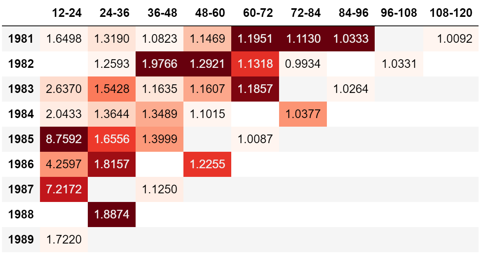

.. _development_docs:

===========================
Development Estimators
===========================

.. currentmodule:: chainladder

Basics and Commonalities
=========================

Before stepping into fitting development patterns, its worth reviewing the basics
of Estimators. The main modeling API implemented by chainladder follows that of
the scikit-learn estimator. An estimator is any object that learns from data.

Scikit-Learn API
----------------
The scikit-learn API is a common modeling interface that is used to construct and
fit a countless variety of machine learning algorithms.  The common interface
allows for very quick swapping between models with minimal code changes.  The
``chainladder`` package has adopted the interface to promote a standardized approach
to fitting reserving models.

All estimator objects can optionally be configured with parameters to uniquely
specify the model being built.  This is done ahead of pushing any data through
the model.

  >>> estimator = Estimator(param1=1, param2=2)

All estimator objects expose a ``fit`` method that takes a `Triangle` as input, ``X``:

  >>> estimator.fit(X=data)

All estimators include a ``sample_weight`` option to the ``fit`` method to specify
an exposure basis.  If an exposure base is not applicable, then this argument is
ignored.

  >>> estimator.fit(X=data, sample_weight=weight)

All estimators either ``transform`` the input Triangle or ``predict`` an outcome.

Transformers
------------
All transformers include a ``transform`` method.  The method is used to transform a
Triangle and it will always return a Triangle with added features based on the
specifics of the transformer.

  >>> transformed_data = estimator.transform(data)

Other than final IBNR models, most ``chainladder`` estimators are transformers.

Transforming can be done at the time of fit.

  >>> # Fitting and Transforming
  >>> estimator.fit(data)
  >>> transformed_data = estimator.transform(data)
  >>> # One line equivalent
  >>> transformed_data = estimator.fit_transform(data)

Predictors
----------
All predictors include a ``predict`` method.

  >>> prediction = estimator.predict(new_data)

Predictors are intended to create new predictions. All IBNR models are predictors
though the ``predict`` method is seldom invoked.  This is because actuarial reserving
techniques tend to not hold out data when parameterizing a model.  Additionally,
we're typically not trying to generalize the model to any reserving time period,
but rather to the specific reserve valuation under review.

Parameter Types
---------------
Estimator parameters: All the parameters of an estimator can be set when it is
instantiated or by modifying the corresponding attribute.  These parameters
define how you'd like to fit an estimator and are chosen before the fitting
process.  These are often referred to as hyperparameters in the context of
Machine Learning:

  >>> estimator = Estimator(param1=1, param2=2)
  >>> estimator.param1
  1

Estimated parameters: When data is fitted with an estimator, parameters are
estimated from the data at hand. All the estimated parameters are attributes
of the estimator object ending by an underscore.  The use of the underscore is
a key API design style of scikit-learn that allows for the quicker recognition
of fitted parameters vs hyperparameters:

  >>> estimator.estimated_param_

In many cases the estimated parameters are themselves Triangles and can be
manipulated using the same methods we learned about in the :class:`Triangle` class.

  >>> dev = cl.Development().fit(cl.load_sample('ukmotor'))
  >>> type(dev.cdf_)
  <class 'chainladder.core.triangle.Triangle'>

Commonalities
--------------

All "Development Estimators" reveal common a set of properties when they are fit.

1. ``ldf_`` represents the fitted age-to-age factors of the model.
2. ``cdf_`` represents the fitted age-to-ultimate factors of the model.
3. All "Development estimators" implement the ``transform`` method.

``cdf_`` is nothing more than the cumulative representation of the ``ldf_`` vectors.

  >>> import chainladder as cl
  >>> dev = cl.Development().fit(cl.load_sample('raa'))
  >>> dev.ldf_.incr_to_cum() == dev.cdf_
  True

.. _dev:

Development
============

:class:`Development` allows for the selection of loss development patterns. Many
of the typical averaging techniques are available in this class: ``simple``,
``volume`` and  ``regression`` through the origin. Additionally, :class:`Development`
includes patterns to allow for fine-tuned exclusion of link-ratios from the LDF
calculation.

Setting parameters
-------------------

Most of the arguments of the ``Development`` class can be specified for all
development ages by providing a single value:

  >>> import chainladder as cl
  >>> raa = cl.load_sample('raa')
  >>> cl.Development(average='simple')
  Development(average='simple', drop=None, drop_high=None, drop_low=None,
              drop_valuation=None, fillna=None, n_periods=-1,
              sigma_interpolation='log-linear')

Alternatively, you can provide a list to parameterize each development period
separately.  When adjusting individual development periods the list must be
the same length as your triangles ``link_ratio`` development axis.

  >>> len(raa.link_ratio.development)
  9
  >>> cl.Development(average=['volume']+['simple']*8)
  Development(average=['volume', 'simple', 'simple', 'simple', 'simple', 'simple',
                       'simple', 'simple', 'simple'],
              drop=None, drop_high=None, drop_low=None, drop_valuation=None,
              fillna=None, n_periods=-1, sigma_interpolation='log-linear')

This approach works for ``average``, ``n_periods``, ``drop_high`` and ``drop_low``.

Notice in both cases, where you have not specified a parameter, a sensible default
is chosen for you.

.. _dropping:

Omitting link ratios
--------------------
There are several arguments for dropping individual cells from the triangle as
well as excluding whole valuation periods or highs and lows.  Any combination
of the 'drop' arguments is permissible.

**Example:**
   >>> import chainladder as cl
   >>> raa = cl.load_sample('raa')
   >>> cl.Development(drop_high=True, drop_low=True).fit(raa)
   >>> cl.Development(drop_valuation='1985').fit(raa)
   >>> cl.Development(drop=[('1985', 12), ('1987', 24)]).fit(raa)
   >>> cl.Development(drop=('1985', 12), drop_valuation='1988').fit(raa)

When using ``drop``, the earliest age of the ``link_ratio`` should be referenced.
For example, use ``12`` to drop the ``12-24`` ratio.

.. note::
  ``drop_high`` and ``drop_low`` are ignored in cases where the number of link
  ratios available for a given development period is less than 3.

Properties
----------
:class:`Development` uses the regression approach suggested by Mack to estimate
development patterns.  Using the regression framework, we not only get estimates
for our patterns (``cdf_``, and ``ldf_``), but also measures of variability of
our estimates (``sigma_``, ``std_err_``).  These variability properties are
used to develop the stochastic features in the `MackChainladder` method, but for
deterministic exercises, can be ignored.

Transforming
------------
When transforming a `Triangle`, you will receive a copy of the original
triangle back along with the fitted properties of the `Development`
estimator.  Where the original Triangle contains all link ratios, the transformed
version recognizes any ommissions you specify.

  >>> import chainladder as cl
  >>> triangle = cl.load_sample('raa')
  >>> dev = cl.Development(drop=('1982', 12), drop_valuation='1988')
  >>> transformed_triangle = dev.fit_transform(triangle)
  >>> transformed_triangle.ldf_
            12-24     24-36     36-48     48-60     60-72     72-84     84-96    96-108   108-120
  (All)  2.662527  1.544686  1.297522  1.171947  1.113358  1.046817  1.029409  1.033088  1.009217
  >>> transformed_triangle.link_ratio.heatmap()

By decoupling the ``fit`` and ``transform`` methods, we can apply our :class:`Development`
estimator to new data.  This is a common pattern of the scikit-learn API. In this
example we generate development patterns at an industry level and apply those
patterns to individual companies.

  >>> import chainladder as cl
  >>> clrd = cl.load_sample('clrd')
  >>> clrd = clrd[clrd['LOB']=='wkcomp']['CumPaidLoss']
  >>> # Summarize Triangle to industry level to estimate patterns
  ... dev = cl.Development().fit(clrd.sum())
  >>> # Apply Industry patterns to individual companies
  ... dev.transform(clrd)
  Valuation: 1997-12
  Grain:     OYDY
  Shape:     (132, 1, 10, 10)
  Index:      ['GRNAME', 'LOB']
  Columns:    ['CumPaidLoss']

.. _dev_const:

DevelopmentConstant
===================

External patterns
------------------

The :class:`DevelopmentConstant` estimator simply allows you to hard code development
patterns into a Development Estimator.  A common example would be to include a
set of industry development patterns in your workflow that are not directly
estimated from any of your own data.

  >>> triangle = cl.load_sample('ukmotor')
  >>> patterns={12: 2, 24: 1.25, 36: 1.1, 48: 1.08, 60: 1.05, 72: 1.02}
  >>> cl.DevelopmentConstant(patterns=patterns, style='ldf').fit(triangle).ldf_
      12-24  24-36  36-48  48-60  60-72  72-84
  (All)    2.0   1.25    1.1   1.08   1.05   1.02

By wrapping patterns in the :class:`DevelopmentConstant` estimator, we can integrate
into a larger workflow with tail extrapolation and IBNR calculations.

Function of patterns
--------------------

:class:`DevelopmentConstant` doesn't have to be limited to one set of fixed patterns.
It can take any arbitrary function similar to how ``pandas.DataFrame.apply`` works. Refer
to this link for a detailed example:

.. figure:: /auto_examples/images/sphx_glr_plot_callable_dev_constant_001.png
   :target: ../auto_examples/plot_callable_dev_constant.html
   :align: center
   :scale: 75%

.. _incremental:

IncrementalAdditive
===================

The :class:`IncrementalAdditive` method uses both the triangle of incremental
losses and the exposure vector for each accident year as a base. Incremental
additive ratios are computed by taking the ratio of incremental loss to the
exposure (which has been adjusted for the measurable effect of inflation), for
each accident year. This gives the amount of incremental loss in each year and
at each age expressed as a percentage of exposure, which we then use to square
the triangle.

.. topic:: References

  .. [S2006] K Schmidt, "Methods and Models of Loss Reserving Based on Run–Off Triangles: A Unifying Survey"

.. _munich:

MunichAdjustment
=================
The :class:`MunichAdjustment` is a bivariate adjustment to loss development factors.
There is a fundamental correlation between the paid and the case incurred data
**(P/I)** of a triangle. The ratio of paid to incurred has information that can
be used to simultaneously adjust the basic development factor selections for the
two separate triangles.

Depending on whether the momentary **(P/I)** ratio is below or above average,
one should use an above-average or below-average paid development factor and/or
a below-average or above-average incurred development factor.  In doing so, the
model replaces a set of development patterns that would be used for all
``origins`` with individualized development curves that reflect the unique levels
of **(P/I)** per origin period.

The :class:`MunichAdjustment` uses the correlation between the residuals of the
univariate (basic) model and the (P/I) model.

.. figure:: /auto_examples/images/sphx_glr_plot_munich_resid_001.png
   :target: ../auto_examples/plot_munich_resid.html
   :align: center
   :scale: 50%

With the correlations, ``lambda_`` known, the basic development patterns can
be adjusted based on the **(P/I)** ratio at any given cell of the ``Triangle``.

.. topic:: References

  .. [QM2004] `G Quarg, Gerhard, and T Mack, "Munich Chain Ladder: A Reserving Method that Reduces the Gap between IBNR" <http://www.variancejournal.org/issues/02-02/266.pdf>`__

.. _clarkldf:

ClarkLDF
=========
:class:`ClarkLDF` is an application of Maximum Likelihood Estimation (MLE) theory
for modeling the distribution of loss development. This model is used to estimate
future loss emergence, and the variability around that estimate. The value of
using an exposure base to supplement the data in a development triangle is
demonstrated as a means of reducing variability.

Growth curves
-------------
:class:`ClarkLDF` estimates growth curves of the form 'loglogistic' or 'weibull'
for the incremental loss development of a `Triangle`.  These growth curves are
monotonic increasing and are more relevant for paid data.  While the model can
be used for case incurred data, if there is too much "negative" development,
other Estimators should be used.

The ``Loglogistic`` Growth Function:

.. math::
   G(x|\omega, \theta) =\frac{x^{\omega }}{x^{\omega } + \theta^{\omega }}

The ``Weibull`` Growth Function:

.. math::
  G(x|\omega, \theta) =1-exp(-\left (\frac{x}{\theta}  \right )^\omega)

.. figure:: /auto_examples/images/sphx_glr_plot_clarkldf_001.png
   :target: ../auto_examples/plot_clarkldf.html
   :align: center
   :scale: 50%

Parameterized growth curves can produce patterns for any age and can even be used
to estimate a tail beyond the latest age in a Triangle.  In general, the
``loglogistic`` growth curve produces a larger tail than the ``weibull`` growth curve.

LDF and Cape Cod methods
------------------------
Clark approaches curve fitting with two different methods, an LDF approach and
a Cape Cod approach.  The LDF approach only requires a loss triangle whereas
the Cape Cod approach would also need a premium vector.  Choosing between the
two methods occurs at the time you fit the estimator.  When a premium vector
is included, the Cape Cod method is invoked.

A simple example of using :class:`ClarkLDF` LDF Method. Upon fitting the Estimator,
we obtain both ``omega_`` and ``theta_``.

  >>> import chainladder as cl
  >>> clrd = cl.load_sample('clrd').groupby('LOB').sum()
  >>> cl.ClarkLDF(growth='weibull').fit(clrd['CumPaidLoss']).omega_
            CumPaidLoss
  LOB
  comauto      0.928921
  medmal       1.569647
  othliab      1.330084
  ppauto       0.831528
  prodliab     1.456167
  wkcomp       0.898282

Another example showing the usage of the :class:`ClarkLDF` Cape Cod approach. With
the Cape Cod, an Expected Loss Ratio is included as an extra feature in the
``elr_`` property.

  >>> cl.ClarkLDF().fit(clrd['CumPaidLoss'], sample_weight=clrd['EarnedPremDIR'].latest_diagonal).elr_
            CumPaidLoss
  LOB
  comauto      0.680297
  medmal       0.701447
  othliab      0.623781
  ppauto       0.825931
  prodliab     0.671010
  wkcomp       0.697926

Residuals
---------
Clark's model assumes Incremental losses are independent and identically
distributed.  To ensure compatibility with this assumption, he suggests
reviewing the "Normalized Residuals" of the fitted incremental losses to ensure
the assumption is not violated.

.. figure:: /auto_examples/images/sphx_glr_plot_clarkldf_resid_001.png
   :target: ../auto_examples/plot_clarkldf_resid.html
   :align: center
   :scale: 50%

Stochastics
-----------
Using MLE to solve for the growth curves, we can produce statistics about the
parameter and process uncertainty of our model.

.. topic:: References

  .. [CD2003] `Clark, David R., "LDF Curve-Fitting and Stochastic Reserving: A Maximum Likelihood Approach",
               Casualty Actuarial Society Forum, Fall, 2003 <https://www.casact.org/pubs/forum/03fforum/03ff041.pdf>`__

CaseOutstanding
================

The :class:`CaseOutstanding` method is a deterministic method that estimates
incremental payment patterns from prior lag carried case reserves.  Included
in this is also patterns for the carried case reserves based on the prior lag
carried case reserve.

Like the :class:`MunichAdjustment` and :class:`BerquistSherman`, this estimator
is useful when you want to incorporate information about case reserves into paid
ultimates.

To use it, a triangle with both paid and incurred amounts must be available.

  >>> import chainladder as cl
  >>> tri = cl.load_sample('usauto')
  >>> model = cl.CaseOutstanding(paid_to_incurred=('paid', 'incurred')).fit(tri)
  >>> model.paid_ldf_
            12-24     24-36    36-48     48-60     60-72     72-84     84-96    96-108   108-120
  (All)  0.842814  0.709981  0.70835  0.696826  0.637589  0.622016  0.553385  0.437373  0.524347

In the example above, the incremental paid losses during the period 12-24 is expected to be
84.28% of the outstanding case reserve at lag 12.  The set of patterns produced by
:class:`CaseOutstanding` don't follow the multiplicative approach commonly used in the
various IBNR methods making them not directly usable.  Because of this, the estimator
determines the 'implied' multiplicative pattern so that a broader set of IBNR
methods can be used.  Due to the origin period specifics on case reserves, each
origin gets its own set of multiplicative ``ldf_`` patterns.

  >>> model.ldf_['paid']
           12-24     24-36     36-48     48-60     60-72     72-84     84-96    96-108   108-120
  1998  1.792469  1.205560  1.095603  1.045669  1.018931  1.009749  1.004777  1.002288  1.001866
  1999  1.768268  1.198631  1.090150  1.043455  1.019377  1.009244  1.004998  1.002392  1.001904
  2000  1.761959  1.190201  1.089958  1.042975  1.019054  1.010127  1.004585  1.002444  1.001969
  2001  1.743900  1.191331  1.090565  1.043566  1.018677  1.009022  1.004171  1.002074  1.001672
  2002  1.734765  1.194005  1.089153  1.044183  1.018551  1.008452  1.004106  1.002042  1.001646
  2003  1.718935  1.185285  1.091988  1.043790  1.018635  1.009171  1.004452  1.002213  1.001784
  2004  1.702514  1.186716  1.092167  1.041492  1.017863  1.008798  1.004272  1.002124  1.001712
  2005  1.701237  1.186004  1.085897  1.041211  1.017746  1.008741  1.004245  1.002111  1.001701
  2006  1.702795  1.179664  1.085678  1.041114  1.017706  1.008722  1.004236  1.002106  1.001698
  2007  1.669287  1.180366  1.085961  1.041239  1.017758  1.008747  1.004248  1.002112  1.001702

Incremental patterns
---------------------

The incremental patterns of the :class:`CaseOutstanding` method are avilable as
additional properties for review. They are the ``paid_to_prior_case_`` and the
``case_to_prior_case_``. These are useful to review when deciding on the appropriate
hyperparameters for ``paid_n_periods`` and ``case_n_periods``.  Once you are satisfied
with your hyperparameter tuning, you can see the fitted selections in the
``paid_ldf_`` and ``case_ldf_`` incremental patterns.

  >>> model.case_to_prior_case_
           12-24     24-36     36-48     48-60     60-72     72-84     84-96    96-108   108-120
  1998  0.537820  0.554128  0.525253  0.498107  0.532934  0.537997  0.587702  0.697024  0.579812
  1999  0.536825  0.564892  0.544220  0.496910  0.502864  0.579975  0.641971  0.650552       NaN
  2000  0.546126  0.574211  0.539091  0.487208  0.537598  0.543222  0.665505       NaN       NaN
  2001  0.540564  0.566029  0.514819  0.501324  0.507736  0.541364       NaN       NaN       NaN
  2002  0.540900  0.554610  0.540609  0.480216  0.488133       NaN       NaN       NaN       NaN
  2003  0.526510  0.576514  0.536276  0.476418       NaN       NaN       NaN       NaN       NaN
  2004  0.529775  0.566523  0.506884       NaN       NaN       NaN       NaN       NaN       NaN
  2005  0.521531  0.553888       NaN       NaN       NaN       NaN       NaN       NaN       NaN
  2006  0.526122       NaN       NaN       NaN       NaN       NaN       NaN       NaN       NaN
  2007       NaN       NaN       NaN       NaN       NaN       NaN       NaN       NaN       NaN
  >>> model.case_ldf_
            12-24    24-36     36-48     48-60     60-72    72-84     84-96    96-108   108-120
  (All)  0.534019  0.56385  0.529593  0.490031  0.513853  0.55064  0.631726  0.673788  0.579812

.. topic:: References

  .. [F2010] J.  Friedland, "Estimating Unpaid Claims Using Basic Techniques", Version 3, Ch. 12, 2010.
