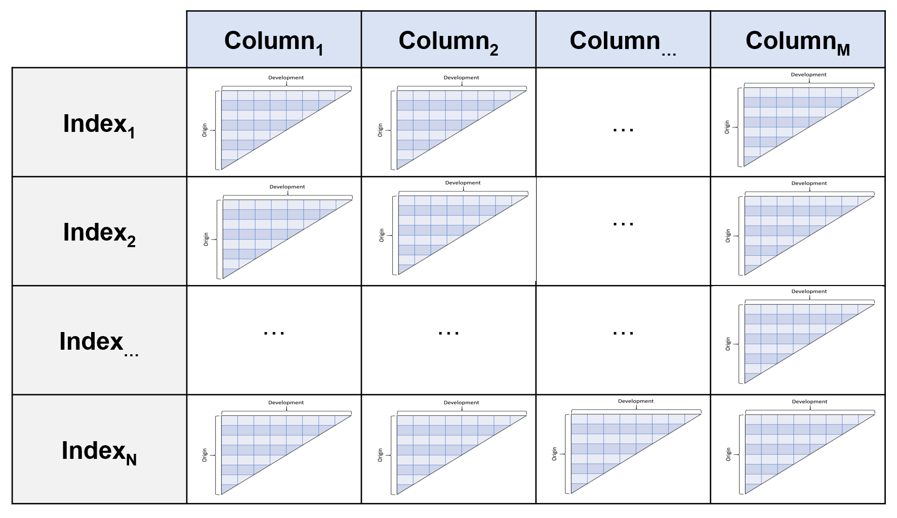

.. _triangle:

.. currentmodule:: chainladder

========
Triangle
========

Structure
=========
Intro
-----
The :class:`Triangle` is the data structure of the chainladder package. Just as
Scikit-learn likes to only consume numpy arrays, Chainladder only likes
Triangles.  It is a 4D data structure with labeled axes.  These axes are its
index, columns, origin, development.

``index`` (axis 0):
    The index  is the lowest grain at which you want to manage the triangle.
    These can be things like state or company.  Like a pandas.multiIndex, you
    can throw more than one column into the index.

``columns`` (axis 1):
    Columns are where you would want to store the different numeric values of your
    data. Paid, Incurred, Counts are all reasonable choices for the columns of your
    triangle.

``origin`` (axis 2):
    The origin is the period of time from which your columns originate.  It can
    be an Accident Month, Report Year, Policy Quarter or any other period-like vector.

``development`` (axis 3):
    Development represents the development age or date of your triangle.
    Valuation Month, Valuation Year, Valuation Quarter in a are good choices.

Despite this structure, you interact with it in the style of pandas. You would
use ``index`` and ``columns`` in the same way you would for a pandas DataFrame.
You can think of the 4D structure as a pandas DataFrame where each cell (row,
column) is its own triangle.

Like pandas, you can access the ``values`` property of a triangle to get its numpy
representation, however the Triangle class provides many helper methods to
keep the shape of the numpy representation in sync with the other Triangle
properties.

Creating a Triangle
===================
Basic requirements
------------------
You must have a pandas DataFrame on hand to create a triangle.  While
data can come in a variety of forms those formats should be coerced to a pandas
DataFrame before creating a triangle. The DataFrame also **must** be in tabular
(long) format, not triangle (wide) format:

.. image:: ../_static/images/triangle_bad_good.PNG

At a minimum, the DataFrame must also:

  1. have "date-like" columns for the ``origin`` and ``development`` period of the triangle.
  2. Have a numeric column(s) representing the amount(s) of the triangle.

The reason for these restriction is that the :class:`Triangle` infers a lot of
useful properties from your DataFrame.  For example, it will determine the ``grain``
and ``valuation_date`` of your triangle which in turn are used to derive many
other properties of your triangle without further prompting from you.

Date Inference
--------------
When instantiating a :class:`Triangle`, the ``origin`` and ``development``
arguments can take a ``str`` representing the column name in your pandas DataFrame
that contains the relevant information.  Alternatively, the arguments can also
take a ``list`` in the case where your DataFrame includes multiple columns that
represent the dimension, e.g. ``['accident_year','accident_quarter']`` can be
supplied to create an ``origin`` dimension at the accident quarter grain.

**Example:**
   >>> import chainladder as cl
   >>> cl.Triangle(data, origin='Acc Year', development=['Cal Year', 'Cal Month'], columns=['Paid Loss'])

 The :class:`Triangle` relies heavily on pandas date inference. In fact,
 ``pd.to_datetime(date_like)`` is exactly how it works.  While pandas is excellent
 at inference, it is not perfect. When initializing a Triangle you can always
 use the ``origin_format`` and/or ``development_format`` arguments to force
 the inference.  For example, ``origin_format='%Y/%m/%d'``

Multidimensional Triangle
-------------------------
So far we've seen how to create a single Triangle, but as described in the Intro
the Triangle class can hold multiple triangles at once.  These triangles share the
same ``origin`` and ``development`` axes and act as individual cells would in a
pandas DataFrame.  By specifying one or more ``column`` and one or more ``index``,
we can fill out the 4D triangle structure.

**Example:**
  >>> cl.Triangle(data, origin='Acc Year', development='Cal Year',
  ...             columns=['Paid Loss', 'Incurred Loss'],
  ...             index=['Line of Business', 'State'])

Sample Data
-----------
The ``chainladder`` package has several sample triangles.  Many of these come
from exiting papers and can be used to verify the results of those papers.
Additionally, They are a quick way of exploring the functionality of the package.
These triangles can be called by name using the `load_sample` function.

**Example:**
  >>> cl.load_sample('clrd')

Some of the more commmonly references samples are:

=============== =================
Name            Shape
=============== =================
``abc``         (1, 1, 11, 11)
``clrd``        (775, 6, 10, 10)
``genins``      (1, 1, 10, 10)
``quarterly``   (1, 2, 12, 45)
``raa``         (1, 1, 10, 10)
=============== =================

For a complete list, see :ref:`samples<samples>`.

Other Parameters
----------------
Whether a triangle is cumulative or incremental in nature cannot be inferred
from the "date-like" vectors of your DataFrame.  You can optionally specify this
property with the ``cumulative`` parameter.

**Example:**
  >>> import chainladder as cl
  >>> cl.Triangle(data, origin='Acc Year', development=['Cal Year'], columns=['Paid Loss'], cumulative=True)

.. note::
  The ``cumulative`` parameter is completely optional.  If it is not specified,
  the Triangle will infer its cumulative/incremental status at the point you
  call on the `cum_to_incr` or `incr_to_cum` methods discussed below.  Some methods
  may not work until the cumulative/incremental status is known.

Backend
-------
:class:`Triangle` is built on numpy which serves as the array backend by default.
Howver, you can now swap array_backend between numpy and cupy to switch between
CPU and GPU-based computations.

Array backends can be set globally:

  >>> import chainladder as cl
  >>> cl.array_backend('cupy')

Alternatively, they can be set per Triangle instance.

  >>> cl.Triangle(..., array_backend='cupy')

.. note::
   You must have a CUDA-enabled graphics card and CuPY installed to use the GPU
   backend.  These are optional dependencies of chainladder.

Basic Functionality
===================
Representation
--------------
The :class:`Triangle` has two different representations.  When only a single
`index` AND single `column` is selected.  The triangle is the typical 2-dimensional
representation we typically think of.

**Example:**
  >>> triangle = cl.load_sample('ukmotor')
  >>> triangle.shape
  (1, 1, 7, 7)
  >>> triangle
            12      24       36       48       60       72       84
  2007  3511.0  6726.0   8992.0  10704.0  11763.0  12350.0  12690.0
  2008  4001.0  7703.0   9981.0  11161.0  12117.0  12746.0      NaN
  2009  4355.0  8287.0  10233.0  11755.0  12993.0      NaN      NaN
  2010  4295.0  7750.0   9773.0  11093.0      NaN      NaN      NaN
  2011  4150.0  7897.0  10217.0      NaN      NaN      NaN      NaN
  2012  5102.0  9650.0      NaN      NaN      NaN      NaN      NaN
  2013  6283.0     NaN      NaN      NaN      NaN      NaN      NaN

If more than one `index` or more than one column is present, then the Triangle
takes on more of a summary view.

**Example:**
  >>> triangle = cl.load_sample('clrd')
  >>> triangle.shape
  (775, 6, 10, 10)
  >>> triangle
  Valuation: 1997-12
  Grain:     OYDY
  Shape:     (775, 6, 10, 10)
  Index:      ['GRNAME', 'LOB']
  Columns:    ['IncurLoss', 'CumPaidLoss', 'BulkLoss', 'EarnedPremDIR', 'EarnedPremCeded', 'EarnedPremNet']

Link Ratios
-----------
The age-to-age factors or link ratios of a Triangle can be accessed with the
``link_ratio`` property.  Triangles also have a `heatmap` method that can optionally
be called to apply conditional formatting to triangle values along an axis.  The
heatmap method requires IPython/Jupyter notebook to render.

**Example:**
  >>> import chainladder as cl
  >>> triangle = cl.load_sample('abc')
  >>> triangle.link_ratio.heatmap()

If executed in a notebook environment should produce:

.. figure:: ../_static/images/heatmap.PNG
   :align: center
   :scale: 40%

Valuation vs Development
------------------------
While most Estimators that use triangles expect the development period to be
expressed as an origin age, it is possible to transform a triangle into a valuation
triangle where the development periods are converted to valuation periods.  Expressing
triangles this way may provide a more convenient view of valuation slices.
Switching between a development triangle and a valuation triangle can be
accomplished with the method `dev_to_val` and its inverse `val_to_dev`.

**Example:**
   >>> import chainladder as cl
   >>> cl.load_sample('raa').dev_to_val()
           1981    1982     1983     1984     1985     1986     1987     1988     1989     1990
   1981  5012.0  8269.0  10907.0  11805.0  13539.0  16181.0  18009.0  18608.0  18662.0  18834.0
   1982     NaN   106.0   4285.0   5396.0  10666.0  13782.0  15599.0  15496.0  16169.0  16704.0
   1983     NaN     NaN   3410.0   8992.0  13873.0  16141.0  18735.0  22214.0  22863.0  23466.0
   1984     NaN     NaN      NaN   5655.0  11555.0  15766.0  21266.0  23425.0  26083.0  27067.0
   1985     NaN     NaN      NaN      NaN   1092.0   9565.0  15836.0  22169.0  25955.0  26180.0
   1986     NaN     NaN      NaN      NaN      NaN   1513.0   6445.0  11702.0  12935.0  15852.0
   1987     NaN     NaN      NaN      NaN      NaN      NaN    557.0   4020.0  10946.0  12314.0
   1988     NaN     NaN      NaN      NaN      NaN      NaN      NaN   1351.0   6947.0  13112.0
   1989     NaN     NaN      NaN      NaN      NaN      NaN      NaN      NaN   3133.0   5395.0
   1990     NaN     NaN      NaN      NaN      NaN      NaN      NaN      NaN      NaN   2063.0

Incremental vs Cumulative
--------------------------
A triangle is either cumulative or incremental.  The ``is_cumulative``
property will identify this trait.  Accumulating an incremental triangle can
be acomplished with `incr_to_cum`.  The inverse operation is `cum_to_incr`.

**Example:**
  >>> import chainladder as cl
  >>> raa = cl.load_sample('raa')
  >>> raa.is_cumulative
  True
  >>> raa.cum_to_incr()
           12      24      36      48      60      72      84     96     108    120
  1981  5012.0  3257.0  2638.0   898.0  1734.0  2642.0  1828.0  599.0   54.0  172.0
  1982   106.0  4179.0  1111.0  5270.0  3116.0  1817.0  -103.0  673.0  535.0    NaN
  1983  3410.0  5582.0  4881.0  2268.0  2594.0  3479.0   649.0  603.0    NaN    NaN
  1984  5655.0  5900.0  4211.0  5500.0  2159.0  2658.0   984.0    NaN    NaN    NaN
  1985  1092.0  8473.0  6271.0  6333.0  3786.0   225.0     NaN    NaN    NaN    NaN
  1986  1513.0  4932.0  5257.0  1233.0  2917.0     NaN     NaN    NaN    NaN    NaN
  1987   557.0  3463.0  6926.0  1368.0     NaN     NaN     NaN    NaN    NaN    NaN
  1988  1351.0  5596.0  6165.0     NaN     NaN     NaN     NaN    NaN    NaN    NaN
  1989  3133.0  2262.0     NaN     NaN     NaN     NaN     NaN    NaN    NaN    NaN
  1990  2063.0     NaN     NaN     NaN     NaN     NaN     NaN    NaN    NaN    NaN

Triangle Grain
----------------
If your triangle has origin and development grains that are more frequent then
yearly, you can easily swap to a higher grain using the `grain` method of the
:class:`Triangle`. The `grain` method recognizes Yearly (Y), Quarterly (Q), and
Monthly (M) grains for both the origin period and development period.

**Example:**
   >>> import chainladder as cl
   >>> cl.load_sample('quarterly')
   Valuation: 2006-03
   Grain:     OYDQ
   Shape:     (1, 2, 12, 45)
   index:      ['Total']
   columns:    ['incurred', 'paid']
   >>> cl.load_sample('quarterly').grain('OYDY')
   Valuation: 2006-03
   Grain:     OYDY
   Shape:     (1, 2, 12, 12)
   index:      ['Total']
   columns:    ['incurred', 'paid']

It is generally a good practice to bring your data in at the lowest grain available,
so that you have full flexibility in aggregating to the grain of your choosing for
analysis and separately, the grain of your choosing for reporting and communication.

Commutativity
-------------
Where possible, the triangle methods are designed to be commutative.  For example,
each of these operations is functionally equivalent..

**Example:**
   >>> import chainladder as cl
   >>> tri = cl.load_sample('quarterly')
   >>> # Functionally equivalent transformations
   >>> tri.grain('OYDY').val_to_dev() == tri.val_to_dev().grain('OYDY')
   >>> tri.cum_to_incr().grain('OYDY').val_to_dev() == tri.val_to_dev().cum_to_incr().grain('OYDY')
   >>> tri.grain('OYDY').cum_to_incr().val_to_dev().incr_to_cum() == tri.val_to_dev().grain('OYDY')

See :class:`Triangle` for the complete API specification of methods and attributes.

Trend
-----
A uniform `trend` factor can also be applied to a Triangle.  The trend can
be applied along the `origin` or `valuation` axes.

  >>> import chainladder as cl
  >>> tri = cl.load_sample('ukmotor')
  >>> # Dividing by original triangle to show the trend factor
  >>> tri.trend(0.05, axis='valuation')/tri
              12        24        36        48        60        72   84
  2007  1.340185  1.276239  1.215506  1.157664  1.102574  1.049965  1.0
  2008  1.276239  1.215506  1.157664  1.102574  1.049965  1.000000  NaN
  2009  1.215506  1.157664  1.102574  1.049965  1.000000       NaN  NaN
  2010  1.157664  1.102574  1.049965  1.000000       NaN       NaN  NaN
  2011  1.102574  1.049965  1.000000       NaN       NaN       NaN  NaN
  2012  1.049965  1.000000       NaN       NaN       NaN       NaN  NaN
  2013  1.000000       NaN       NaN       NaN       NaN       NaN  NaN

While the `trend` method only allows for a single trend, you can create
compound trends using `start` and `end` arguments and chaining them together.

  >>> tri.trend(0.05, axis='valuation', start=tri.valuation_date, end='2011-12-31') \
  ...    .trend(0.10, axis='valuation', start='2011-12-31')/tri
              12        24        36        48        60        72   84
  2007  1.614494  1.467434  1.334118  1.212914  1.102574  1.049965  1.0
  2008  1.467434  1.334118  1.212914  1.102574  1.049965  1.000000  NaN
  2009  1.334118  1.212914  1.102574  1.049965  1.000000       NaN  NaN
  2010  1.212914  1.102574  1.049965  1.000000       NaN       NaN  NaN
  2011  1.102574  1.049965  1.000000       NaN       NaN       NaN  NaN
  2012  1.049965  1.000000       NaN       NaN       NaN       NaN  NaN
  2013  1.000000       NaN       NaN       NaN       NaN       NaN  NaN

Correlation Tests
------------------
The multiplicative chainladder method is based on the strong assumptions of
independence across origin years and across valuation years. Mack developed
tests to verify if these assumptions hold.

These tests are included as methods on the triangle class `valuation_correlation`
and `development_correlation`. ``False`` indicates that correlation between years
is not sufficiently large.

**Example:**
  >>> import chainladder as cl
  >>> triangle = cl.load_sample('raa')
  >>> triangle.valuation_correlation().z_critical
          1982   1983   1984   1985   1986   1987   1988   1989   1990
  (All)  False  False  False  False  False  False  False  False  False
  >>> triangle.development_correlation().t_critical
         values
  Total
  Total   False

There are many properties of these correlation tests and they've been included
as their own classes.  Refer to :class:`ValuationCorrelation` and
:class:`DevelopmentCorrelation` for additional information.

.. topic:: References

  .. [MT1994] `Mack, T., Measuring the Variability of Chain Ladder Reserve Estimates,
      Casualty Actuarial Society Forum, Spring 1994 <https://www.actuaries.org.uk/system/files/documents/pdf/crm2-D6.pdf>`__

Pandas-style syntax
===================
We've chosen to keep as close as possible to pandas syntax for Triangle data
manipulation.  Relying on the most widely used data manipulation library in Python
gives us two benefits.  This not only allows for easier adoption, but also provides
stability to the ``chainladder`` API.

.. _slicing:
Slicing and Filtering
---------------------
With a newly minted :class:`Triangle`, individual triangles can be sliced out
of the object using pandas-style ``loc``/``iloc`` or boolean filtering.

**Example:**
   >>> import chainladder as cl
   >>> clrd = cl.load_sample('clrd')
   >>> clrd.iloc[0,1]
   >>> clrd[clrd['LOB']=='othliab']
   >>> clrd['EarnedPremDIR']

.. note::
   Boolean filtering on non-index columns in pandas feels natural.  We've exposed
   the same syntax specifically for the index column(s) of the Triangle without the
   need for ``reset_index()`` or trying to boolean-filter a ``MultiIndex``. This is
   a divergence from the pandas API.

Arithmetic
----------
Most arithmetic operations can be used to create new triangles within your
triangle instance. Like with pandas, these can automatically be added as new
columns to your :class:`Triangle`.

**Example:**
   >>> clrd = cl.load_sample('clrd')
   >>> clrd['CaseIncur'] = clrd['IncurLoss']-clrd['BulkLoss']
   >>> clrd
   Valuation: 1997-12
   Grain:     OYDY
   Shape:     (775, 7, 10, 10)
   index:      ['GRNAME', 'LOB']
   columns:    ['BulkLoss', 'CumPaidLoss', 'EarnedPremCeded', 'EarnedPremDIR', 'EarnedPremNet', 'IncurLoss', 'CaseIncur']

Arithmetic follows `numpy broadcasting <https://numpy.org/doc/1.18/user/theory.broadcasting.html#array-broadcasting-in-numpy>`_
rules.  If broadcasting fails, arithmetic operations will rely on ``origin`` and
``development`` vectors to determine whether an operation is legal.

**Example:**
  >>> import chainladder as cl
  >>> raa = cl.load_sample('raa')
  >>> # Allow for arithmetic beyond numpy broadcasting rules
  >>> raa[raa.origin<'1985']+raa[raa.origin>='1985']
  >>> # Numpy broadcasting equivalent fails
  >>> raa[raa.origin<'1985'].values+raa[raa.origin>='1985'].values

Aggregations
------------
It is generally good practice to bring your data into ``chainladder`` at a ganularity
that is comfortably supported by your system RAM.  This provides the greatest flexibility
in analyzing your data within the ``chainladder`` framework.  However, not everything
needs to be analyzed at the most granular level. Like pandas, you can aggregate
multiple triangles within a :class:`Triangle` by using ``sum()`` which can
optionally be coupled with ``groupby()``.

**Example:**
   >>> clrd = cl.load_sample('clrd')
   >>> clrd.sum()
   Valuation: 1997-12
   Grain:     OYDY
   Shape:     (1, 6, 10, 10)
   index:      ['All']
   columns:    ['BulkLoss', 'CumPaidLoss', 'EarnedPremCeded', 'EarnedPremDIR', 'EarnedPremNet', 'IncurLoss']
   >>> clrd.groupby('LOB').sum()
   Valuation: 1997-12
   Grain:     OYDY
   Shape:     (6, 6, 10, 10)
   index:      ['LOB']
   columns:    ['BulkLoss', 'CumPaidLoss', 'EarnedPremCeded', 'EarnedPremDIR', 'EarnedPremNet', 'IncurLoss']

By default, the aggregation will apply to the first axis with a length greater
than 1. Alternatively, you can specify the axis using the ``axis`` argument of
the aggregate method.

Converting to DataFrame
-----------------------
When a triangle is presented with a single index level and single column, it
becomes a 2D object.  As such, its display format changes to that similar to a
dataframe.  These 2D triangles can easily be converted to a pandas dataframe
using the `to_frame` method.

**Example:**
  >>> import chainladder as cl
  >>> clrd = cl.load_sample('clrd')
  >>> clrd
  Valuation: 1997-12
  Grain:     OYDY
  Shape:     (775, 6, 10, 10)
  Index:      ['GRNAME', 'LOB']
  Columns:    ['BulkLoss', 'CumPaidLoss', 'EarnedPremCeded', 'EarnedPremDIR', 'EarnedPremNet', 'IncurLoss']
  >>> clrd[clrd['LOB']=='ppauto']['CumPaidLoss'].sum().to_frame()
              12          24          36          48          60          72          84          96         108        120
  1988  3092818.0   5942711.0   7239089.0   7930109.0   8318795.0   8518201.0   8610355.0   8655509.0  8682451.0  8690036.0
  1989  3556683.0   6753435.0   8219551.0   9018288.0   9441842.0   9647917.0   9753014.0   9800477.0  9823747.0        NaN
  1990  4015052.0   7478257.0   9094949.0   9945288.0  10371175.0  10575467.0  10671988.0  10728411.0        NaN        NaN
  1991  4065571.0   7564284.0   9161104.0  10006407.0  10419901.0  10612083.0  10713621.0         NaN        NaN        NaN
  1992  4551591.0   8344021.0  10047179.0  10901995.0  11336777.0  11555121.0         NaN         NaN        NaN        NaN
  1993  5020277.0   9125734.0  10890282.0  11782219.0  12249826.0         NaN         NaN         NaN        NaN        NaN
  1994  5569355.0   9871002.0  11641397.0  12600432.0         NaN         NaN         NaN         NaN        NaN        NaN
  1995  5803124.0  10008734.0  11807279.0         NaN         NaN         NaN         NaN         NaN        NaN        NaN
  1996  5835368.0   9900842.0         NaN         NaN         NaN         NaN         NaN         NaN        NaN        NaN
  1997  5754249.0         NaN         NaN         NaN         NaN         NaN         NaN         NaN        NaN        NaN

From this point the results can be operated on directly in pandas.  The
`to_frame()` functionality works when a Triangle is sliced down to any two axes
and is not limited to just the ``index`` and ``column``.

**Example:**
  >>> # 2D Triangle expressed as a Triangle
  >>> clrd['CumPaidLoss'].groupby('LOB').sum().latest_diagonal
  Valuation: 1997-12
  Grain:     OYDY
  Shape:     (6, 1, 10, 1)
  Index:      ['LOB']
  Columns:    ['CumPaidLoss']
  >>> # 2D Triangle expressed as a DataFrame
  >>> clrd['CumPaidLoss'].groupby('LOB').sum().latest_diagonal.to_frame()
  origin         1988       1989        1990        1991        1992        1993        1994        1995       1996       1997
  comauto    626097.0   674441.0    718396.0    711762.0    731033.0    762039.0    768095.0    675166.0   510191.0   272342.0
  medmal     217239.0   222707.0    235717.0    275923.0    267007.0    276235.0    252449.0    209222.0   107474.0    20361.0
  othliab    317889.0   350684.0    361103.0    426085.0    389250.0    434995.0    402244.0    294332.0   191258.0    54130.0
  ppauto    8690036.0  9823747.0  10728411.0  10713621.0  11555121.0  12249826.0  12600432.0  11807279.0  9900842.0  5754249.0
  prodliab   110973.0   112614.0    121255.0    100276.0     76059.0     94462.0    111264.0     62018.0    28107.0    10682.0
  wkcomp    1241715.0  1308706.0   1394675.0   1414747.0   1328801.0   1187581.0   1114842.0    962081.0   736040.0   340132.0

Exposing Pandas functionality
-----------------------------
The ability to move from a 2D triangle to a pandas DataFrame opens up the full
suite of pandas functionality to you.  For the more commonly used
functionality, we handle the ``to_frame()`` for you.  For example,
``triangle.to_frame().plot()`` is equivalent to ``triangle.plot()``.

**Example**
  >>> cl.load_sample('clrd').groupby('LOB').sum().loc['wkcomp', 'CumPaidLoss'].T.plot(
  ...     marker='.', grid=True,
  ...     title='CAS Loss Reserve Database: Workers Compensation').set(
  ...     xlabel='Development Period', ylabel='Cumulative Paid Loss');

.. figure:: /auto_examples/images/sphx_glr_plot_triangle_from_pandas_001.png
   :target: ../auto_examples/plot_triangle_from_pandas.html
   :align: center
   :scale: 50%

Many of the more commonly used pandas methods are passed through in this way
allowing for working with triangles as DataFrames.

============ ================ =========== ==================
Aggregations IO               Shaping     Other
============ ================ =========== ==================
`sum`        `to_clipboard`   `unstack`   `plot`
`mean`       `to_csv`         `pivot`     `rename`
`median`     `to_excel`       `melt`      `pct_chg`
`max`        `to_json`        `T`         `round`
`min`        `to_html`        `drop`      `hvplot`
`prod`       `to_dict`        `dropna`    `drop_duplicates`
`var`                                     `describe`
`std`
`cumsum`
`quantile`
============ ================ =========== ==================

.. note::
   While some of these methods have been rewritten to return a Triangle, Many
   are pandas methods and will have return values consistent with pandas.

Accessors
---------
Like pandas ``.str`` and ``.dt`` accessor functions, you can also perform operations
on the ``origin``, ``development`` or ``valuation`` of a triangle. For example, all
of these operations are legal.

**Example:**
   >>> raa = cl.load_sample('raa')
   >>> x = raa[raa.origin=='1986']
   >>> x = raa[(raa.development>=24)&(raa.development<=48)]
   >>> x = raa[raa.origin<='1985-JUN']
   >>> x = raa[raa.origin>'1987-01-01'][raa.development<=36]
   >>> x = raa[raa.valuation<raa.valuation_date]

These accessors apply boolean filtering along the ``origin`` or ``development`` of the
triangle.  Because boolean filtering can only work on one axis at a time, you may
need to split up your indexing to achieve a desired result.

**Example:**
   >>> # Illegal use of boolean filtering of two different axes
   >>> x = raa[(raa.origin>'1987-01-01')&(raa.development<=36)]
   >>> # Instead, chain the boolean filters together.
   >>> x = raa[raa.origin>'1987-01-01'][raa.development<=36]

When using the accessors to filter a triangle, you may be left with empty portions
of the triangle that need to be trimmed up.  The `dropna` method will look for
any origin periods or development periods that are fully empty at the edges
of the triangle and eliminate them for you.

**Example**:
  >>> raa = cl.load_sample('raa')
  >>> raa[raa.origin>'1987-01-01']
           12      24       36   48   60   72   84   96   108  120
  1988  1351.0  6947.0  13112.0  NaN  NaN  NaN  NaN  NaN  NaN  NaN
  1989  3133.0  5395.0      NaN  NaN  NaN  NaN  NaN  NaN  NaN  NaN
  1990  2063.0     NaN      NaN  NaN  NaN  NaN  NaN  NaN  NaN  NaN
  >>> raa[raa.origin>'1987-01-01'].dropna()
            12      24       36
  1988  1351.0  6947.0  13112.0
  1989  3133.0  5395.0      NaN
  1990  2063.0     NaN      NaN

There are many more methods available to manipulate triangles.  The complete
list of methods is available under the :class:`Triangle` docstrings.
