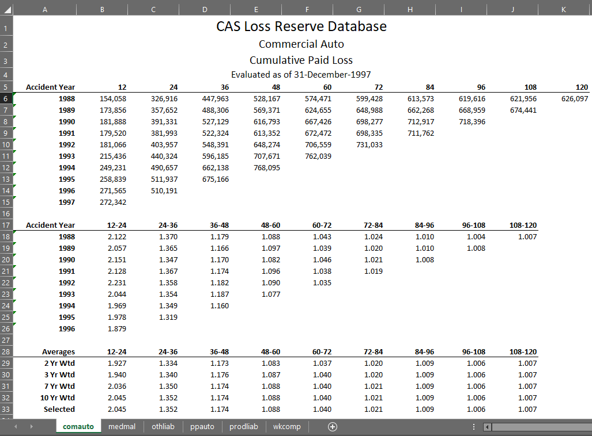

.. _utils:

.. currentmodule:: chainladder

=========
Utilities
=========
Utilities contains example datasets and extra functionality to facilitate a
reserving workflow.

.. _exhibits:

Writing to Excel
================

Example output of Exhibits
--------------------------
The following example highlights the general look of the outputs when using
chainladder to output to Excel.  This functionality comes from the companion
library `xlcompose` which can be independently installed using `pip`

DataFrame
---------

**chainladder** comes with a :class:`chainladder.DataFrame` class that has a supercharged version of
`pd.DataFrame.to_excel`.  This version allows for the export of any number of
DataFrames in any layout desired with formats of your choosing.  Simply wrap a
pandas dataframe the **chainladder** Dataframe to get access to this supercharged version.

**Example:**
   >>> import pandas as pd
   >>> df = pd.DataFrame([['Apple', 7, 3.00],['Orange', 12, 2.50],['Banana', 13, 2.00]],
   >>>                   columns=['Fruit', 'Quantity', 'Cost'])
   >>> cl.DataFrame(df).to_excel('workbook.xlsx')

Immediately, we get better default formatting and better column fitting. The
`DataFrame` class is used exclusively for exporting to Excel and the normal
``pd.DataFrame`` should be used for any other purpose.

There are commonalities between ``cl.DataFrame.to_excel()`` and
``pd.DataFrame.to_excel()``.  For example, both have arguments for ``header``,
``index``, ``index_label`` that behave identically, however the argument
placement happens at object initialization for the :class:`DataFrame`:

**Example:**
   >>> # chainladder
   >>> cl.DataFrame(df, header=True, index=False).to_excel('workbook.xlsx')
   >>> # vs
   >>> # pandas
   >>> df.to_excel('workbook.xlsx', header=False, index=True, index_label='Origin')

Placing the arguments at object initialization allows for the construction
of composite objects as we will see later in the Layouts section.

Formatting
----------

Formatting output is key to having a polished looking spreadsheet, but
unfortunately pandas does not provide much customization in its output.  **chainladder**,
uses **xlsxwriter** to apply formats to the data cells in a `DataFrame`.  Formats
are expressed as dictionaries.  You can specify a single set of formats for the
entire `DataFrame`:

**Example:**
   >>> formats={'num_format': '#,#', 'font_color': 'red'}
   >>> cl.DataFrame(df, formats=formats).to_excel('workbook.xlsx')

Alternatively, you can specify formats for column individually using a
nested dictionary.

**Example:**
   >>> formats={'Quantity':{'num_format':'#,#', 'font_color':'red'},
   ...          'Cost':  {'num_format':'#,0.00', 'bold':True}}

Formatting options exist for the `index` and `header`.  Simply pass the desired
formats through using `index_formats` and `header_formats`.

**Example:**
   >>> index_formats={'italic':True, 'font_color':'red'}
   >>> cl.DataFrame(df, index_formats=index_formats).to_excel('workbook.xlsx')

   .. note::
      **chainladder** has default formats out of the box.  As you apply your own
      formats, the defaults will be applied first followed by your own.

For more information on available cell formats refer to
https://xlsxwriter.readthedocs.io/format.html

Series
------
A Series is a single column of data.  While the DataFrame assigns each of its
columns to a column in a spreadsheet, you can have the Series column of data span
multiple columns in a spreadsheet by passing a `width` argument.  Additionally,
there is a `column_width` argument which determines the column
width of each spreadsheet column used by the Series.

**Example:**
   >>> s = pd.Series(['This Series', 'Spans Multiple', 'Columns'])
   >>> cl.Series(s, width=5, column_widths=12).to_excel('workbook.xlsx')

Taken further, a Series of length 1 can be used to merge any cells horizontally.

**Example:**
   >>> cl.Series(' ', width=10, column_widths=10).to_excel('workbook.xlsx')

Title
-----
Title is a convenience class that behaves like a Series.  It has its own default
formatting style that looks title-esque.  When passed to other objects as the
`title` argument, its width will take on the width of the containing object.
However, it can be used as a stand-alone object much like the Series.

**Example:**
   >>> title=['Sample Inventory',
   ...        'ACME Grocery Company']
   >>> cl.DataFrame(df, title=cl.Title(title)).to_excel('workbook.xlsx')

As with everything else, formats are adjustable through the `formats` argument.

**Example:**
   >>> title_formats = [{'font_color': 'red'},
   ...                  {'font_color': 'green'}]
   >>> cl.DataFrame(df, title=cl.Title(title, formats=title_formats)).to_excel('workbook.xlsx')

Image
-----
Embedding images in Excel can be done with the `Image` class.  However, because
images are not embedded in cells directly, you must specify the `width` and
`height` of the image (in cells) for **chainladder** to know how much room the image
consumes.

**Example:**
   >>> cl.Image('logo.png', width=1, height=5).to_excel('workbook.xlsx')

All objects have a `width` and `height` property.  These properties are used
by **chainladder** to manage placement in the spreadsheet using layout objects.

`Image` also takes a format argument, and as expected, it takes the form of a
dictionary.  Formatting an image follows the options provided by **xlsxwriter**.
Available parameters and default values are:

  >>>  {
  ...      'x_offset':        0,
  ...      'y_offset':        0,
  ...      'x_scale':         1,
  ...      'y_scale':         1,
  ...      'object_position': 2,
  ...      'image_data':      None,
  ...      'url':             None,
  ...      'tip':             None,
  ...  }

Layouts
=======

While the addition of formats, titles and column numbering provide a little more
flexibility that can be obtained from ``pd.DataFrame.to_excel``, **chainladder**
provides a lot more flexibility with its layout objects.  Layouts provide the
composability that
There are three layout objects `Tabs`, `Row`, and `Column`.

.. note::
   The layout API is inspired by the bokeh/holoviz API and should be familiar to
   the practitioner who uses those for visualization.

Rows and Columns
----------------

:class:`Column` takes multiple objects and displays them vertically.  You can
embed as many objects in a column as you like.

**Example:**
   >>> col = cl.Column(
   ...     cl.DataFrame(df),
   ...     cl.DataFrame(df, formats={'italic': True})
   ... )
   >>> col.to_excel('workbook.xlsx')

:class:`Row` takes multiple objects and displays them horizontally.  Similar to
`Column`, you can embed as many other objects in a `Row` as you'd like.

**Example:**
   >>> cl.Row(
   ...     cl.DataFrame(df),
   ...     cl.DataFrame(df, formats={'italic': True})
   ... ).to_excel('workbook.xlsx')

You can also nest other `Row` and `Column` objects within rows and columns.
Nesting can be a deep as you want allowing for a highly customized layout.

**Example:**
   >>> cl.Row(col, col).to_excel('workbook.xlsx')

``Row`` and ``Column`` optionally take `title` keywords that function the same
as those in ``DataFrame``.

**Example:**
   >>> composite = cl.Row(
   ...     cl.Title(['This title spans both Column Objects'],
   ...                formats=[{'underline': True}]),
   ...     col, col
   ... )
   >>> composite.to_excel('workbook.xlsx')

CSpacer and RSpacer
-------------------
Often spacing between separate components in our layout is desired.  For columns
you can insert a CSpacer object and for rows you can insert an RSpacer object.
Like the `Series` the spacer objects have optional `width` and `column_widths`
arguments for further customization.

**Example:**
   >>> composite = cl.Row(
   ...     cl.Title(['This title spans both Column Objects'],
   ...                     formats=[{'underline': True}]),
   ...     col, cl.RSpacer(width=2, column_widths=1.1), col,
   ... )
   >>> composite.to_excel('workbook.xlsx')

Similarly, we can use `CSpacer` on a `Column`.

**Example:**
   >>> composite = cl.Column(
   ...     cl.Title(['This title spans both Column Objects'],
   ...                     formats=[{'underline': True}]),
   ...     cl.CSpacer(),
   ...     col,
   ...     cl.CSpacer(height=2),
   ...     col,
   ... )
   >>> composite.to_excel('workbook.xlsx')

Tabs
----

:class:`Tabs` are the sheet representation of the above objects.  Tabs are
different from ``Row`` and ``Column`` in that each object passed to ``Tabs``
must be expressed as a 2-tuple corresponding to ``('sheet_name', object)``.
The object itself can be any of the above objects.

**Example:**
   >>> cl.Tabs(
   ...    ('a_sheet', composite),
   ...    ('another_sheet', composite)
   ... ).to_excel('workbook.xlsx')

Modifying defaults for all objects
----------------------------------
You may choose to override all defaults.  For example, by default, the font is
set to 'Calibri'.  `to_excel()` takes an additional parameter `default_formats`
to will apply to all nested objects you intend to export.

**Example:**
   >>> cl.Tabs(
   ...    ('a_sheet', composite),
   ...    ('another_sheet', composite)
   ... ).to_excel('workbook.xlsx', default_formats={'font_name': 'Arial'})

If any nested object has a default override, the override will be honored over
this default.

.. _samples:

Sample Datasets
===============
A variety of datasets can be loaded using :func:`load_sample()`.  These are
sample datasets that are used in a variety of examples within this
documentation.

========= =======================================================
Dataset   Description
========= =======================================================
abc       ABC Data
auto      Auto Data
cc_sample Sample Insurance Data for Cape Cod Method in Struhuss
clrd      CAS Loss Reserving DataBase
genins    General Insurance Data used in Clark
ia_sample Sample data for Incremental Additive Method in Schmidt
liab      more data
m3ir5     more data
mcl       Sample insurance data for Munich Adjustment in Quarg
mortgage  more data
mw2008    more data
mw2014    more data
quarterly Sample data to demonstrate changing Triangle grain
raa       Sample data used in Mack Chainladder
ukmotor   more data
usaa      more data
usauto    more data
========= =======================================================
